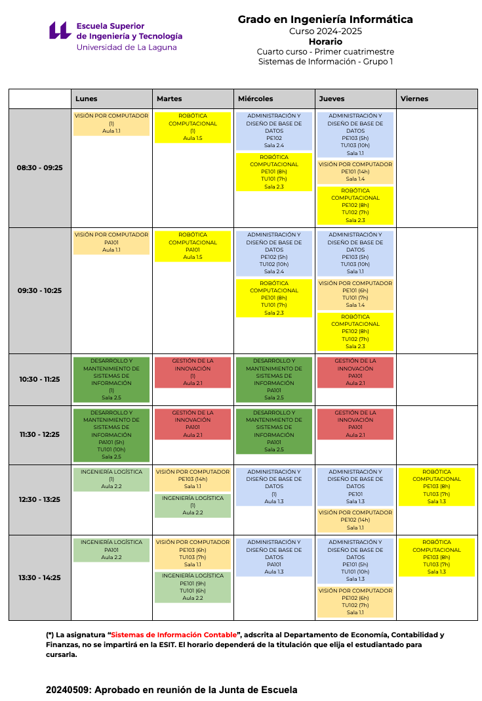

---
toc: true
permalink: /timetables
--- 

# Calendarios, Horarios y Exámenes

## Calendario Académico

* Cierre de actas 29 de Enero

## Horarios

<a href="https://www.ull.es/grados/ingenieria-informatica/informacion-academica/horarios-y-calendario-examenes/" target="_blank">Horarios de Ingeniería Informática para el curso</a>

<!-- 
<a href="https://docs.google.com/spreadsheets/d/1ZTGvLA70qCYEsBwcA8dCiUZby3ZOM9oHt8kmiNNKId0/edit#gid=0" target="_blank">Horarios de tutorías del Departamento de Ingeniería Informática</a>
-->



## Exámenes de convocatoria

- 14/01/25, 9:00, 3.7 Coincide con la última prueba objetiva de evaluación continua
- 10/06/25, 9:00, 3.7
- 01/07/25, 9:30, 3.7

  
## Normativa



